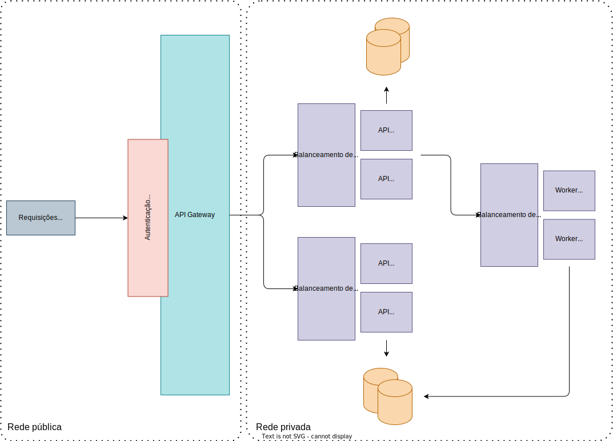
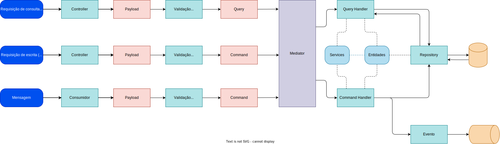

<div align="center">
  <h1>Sistema de lançamentos para comerciantes</h1>
  <p>Um modelo e exemplo de sistema de controle de lançamentos para comerciantes.</p>
  <a href="https://github.com/leandroslc/merchant-accounting-system-architecture/actions/workflows/ci.yml">
    
  </a>
</div>

## Tópicos
- [Sobre o sistema](#sobre-o-sistema)
  - [Funcionalidades](#funcionalidades)
  - [Considerações sobre o sistema](#considerações-sobre-o-sistema)
- [Arquitetura proposta](#arquitetura-proposta)
  - [Decisões arquiteturais](#decisões-arquiteturais)
  - [Considerações sobre a arquitetura](#considerações-sobre-a-arquitetura)
- [Como os sistemas funcionam](#como-os-sistemas-funcionam)
  - [Quais são os dados armazenados](#quais-são-os-dados-armazenados)
- [Arquitetura local](#arquitetura-local)
  - [Tecnologias](#tecnologias)
  - [Limitações](#limitações)
- [Requisitos mínimos](#requisitos-mínimos)
- [Executando as aplicações](#executando-as-aplicações)
  - [Como usar as funcionalidades](#como-usar-as-funcionalidades)
- [Testes de carga](#testes-de-carga)
  - [Executando os testes de carga](#executando-os-testes-de-carga)
- [Arquitetura interna dos serviços](#arquitetura-interna-dos-serviços)
- [Desenvolvimento](#desenvolvimento)
  - [Requisitos para desenvolvimento](#requisitos-para-desenvolvimento)
  - [Extensões úteis para o VS Code](#extensões-úteis-para-o-vs-code)
  - [Iniciando o banco de dados das aplicações](#iniciando-o-banco-de-dados-das-aplicações)
  - [Executar migrations programaticamente](#executar-migrations-programaticamente)
  - [Iniciando o broker de mensageria](#iniciando-o-broker-de-mensageria)
  - [Estrutura dos serviços](#estrutura-dos-serviços)
  - [Fluxo de trabalho](#fluxo-de-trabalho)
- [Documentação dos endpoints](#documentação-dos-endpoints)
  - [Registro de débito](#registro-de-débito)
  - [Registro de crédito](#registro-de-crédito)
  - [Consulta de saldo](#consulta-de-saldo)
  - [Obter token de acesso](#obter-token-de-acesso)
- [Aprimoramentos futuros](#aprimoramentos-futuros)

## Sobre o sistema
Registra operações de lançamentos (débitos e créditos) de comerciantes e gera um saldo diário consolidado com o balanço total de todas as operações realizadas em cada dia.

A ideia é que o próprio comerciante registre operações de caixa e realize a consulta do saldo diário, através de um site ou aplicativo.

### Funcionalidades
- Autenticação do comerciante
- Registro de lançamento de débito
- Registro de lançamento de crédito
- Consulta de saldo consolidado diário

### Considerações sobre o sistema
Alguns fatores influenciaram nas decisões durante a modelagem do sistema:

- Um "lançamento" foi considerado [como descrito na contabilidade](https://en.wikipedia.org/wiki/Debits_and_credits). Como é o próprio comerciante que está registrando a operação, foi considerado que ele está usando uma conta ativa. Dessa forma: débitos aumentam o valor do caixa e créditos diminuem o valor do caixa. De qualquer forma o sistema foi projetado para tornar simples essa modificação, se necessário.

## Arquitetura proposta
> :bulb: Abra a imagem em nova guia para ampliar


Olhando de uma visão macro, o sistema como um todo funciona da seguinte forma:
- O comerciante teria acesso a uma aplicação frontend como um site ou app.
- O aplicativo se autenticaria através de um provedor de autenticação utilizando OpenId Connect. O provedor de autenticação poderia ser o [Keycloak](https://www.keycloak.org/) ou o [Microsoft Entra ID](https://www.microsoft.com/pt-br/security/business/identity-access/microsoft-entra-id), por exemplo.
- Após se autenticar, a aplicação faria uma requisição para o API Gateway (nesse caso representado pelo [kong](https://konghq.com/products/kong-gateway)). O API Gateway valida o token de acesso através do provedor de autenticação e repassa a requisição para os sistemas internos.
- O sistema interno recebe a solicitação do API Gateway, processa e responde de volta para o API Gateway.
- Por sua vez, o API Gateway repassa a resposta, até chegar ao comerciante.

### Decisões arquiteturais
> :bulb: Abra a imagem em nova guia para ampliar



- **Escalabilidade:**
  - Apesar de fazer parte de um sistema único, ele foi dividido em partes independetes para que possam ser facilmente escaláveis. Neste caso, as APIs serão escaladas pelo _throughput_ de requisições HTTP e o worker será escalado pelo _throughput_ de mensagens recebidas.
  - O banco de dados separado das duas aplicações também permite escalabilidade independente.
- **Resiliência:**
  - Os sistemas são independentes. Se uma API falhar, a outra não falha, e vice versa.
  - Se o worker falhar, as APIs não falham e, ao mesmo tempo, as mensagens também não são perdidas, ficam retidas na fila para que sejam consumidas logo quando o consumidor retomar o processamento.
- **Disponibilidade:**
  - A arquitetura foi projetada principalmente para manter uma alta disponibilidade.
  - A API de saldo suporta um alto _throughput_ pois recebe apenas uma requisição de consulta que é feita através de um banco de dados otimizado para leitura.
  - A API de lançamentos recebe requisições otimizadas para escrita, onde operações são apenas adicionadas.
  - O processamento do saldo é feito de forma assíncrona e não interrompe nenhum fluxo. É usada uma abordagem de concorrência otimista, portanto existe apenas uma operação de _lock_ no saldo de apenas um dia (apenas uma linha da tabela do banco de dados) por um período de poucos milissegundos.
- **Segurança:**
  - O sistema como um todo possui apenas uma porta de entrada, que possui auntenticação e pode ser facilmente extensível para suportar _rate limit_.
  - Os sistemas da rede privada ficam inacessíveis externamente. Por conta disso, não há necessidade de revalidar os tokens de acesso já previamente validados e, além disso, não existe obrigatóriedade de se usar HTTPS, que aumentaria latência.
- **Monitoramento:**
  - O API Gateway gera e repassa um _[Correlation Identifier](https://microservices.io/patterns/observability/distributed-tracing.html)_ para os sistemas. Com isso seria possível instrumentar ferramentas de observalidade para realizar o tracing distribuído.

### Considerações sobre a arquitetura
Algumas considerações importantes sobre a arquitetura:
- Apesar de os sistemas terem sido projetados para estarem separados preventivamente, esta arquitetura pode não ser a mais eficiente com relação a custo. Existem aplicações que suportam praticamente mais de 50 requisições por segundo usando apenas um banco de dados e realizando vários processos de consulta, escrita e processamento de mensagens ao mesmo tempo. Por isso é sempre interessante medir o quanto de processamento é suportado e os custos necessários.
- O banco de dados PostgreSQL foi selecionado porque ele é otimizado tanto para escrita e leitura. Além disso, ele foi escolhido principalmente pela alta disponibilidade.
- O banco de dados da API de saldo pode ter inconsistência eventual por conta do processamento assíncrono, apesar de que, por ser um consolidado diário, não causaria impactos para comerciante.
- Nesse primeiro momento não houve necessidade de usar uma ferramenta de cache. Se fosse necessário, seria interessante experimentar um cache "na borda" como um [cache HTTP](https://developer.mozilla.org/en-US/docs/Web/HTTP/Caching) para consulta de saldo (saldos de dias passados não serão alterados com frequência).

## Como os sistemas funcionam
Fluxo de como os sistemas funcionam e interagem entre si de forma mais detalhada:

> :bulb: Abra a imagem em nova guia para ampliar


### Quais são os dados armazenados
Cada serviço consome seu próprio banco de dados. Por ser um sistema simples, existem apenas duas entidades armazenadas:

#### Lançamentos (Operations)
Faz parte do serviço `accounting-operations`.

Coluna          | Tipo         | Descrição
:-------------- | :----------- | :----------------------------------------------
`merchant_id`   | texto        | Um identificador único do comerciante.
`registered_at` | data e tempo | Data e tempo do registro de lançamento, em UTC.
`value`         | monetário    | Valor do lançamento.
`type`          | inteiro      | Identificador do tipo de lançamento (e.g. débito ou crédito).

As colunas `merchant_id` e `registered_at` formam um identificador único composto.

#### Saldos (Balances)
Faz parte do serviço `daily-balances`.

Coluna          | Tipo      | Descrição
:-------------- | :-------- | :----------------------------------------------
`merchant_id`   | texto     | Um identificador único do comerciante.
`day`           | data      | Data (dia).
`total`         | monetário | Valor total do saldo.

As colunas `merchant_id` e `day` formam um identificador único composto.

## Arquitetura local
A arquitetura local (para fins de teste) é muito semelhante com a [arquitetura proposta](#arquitetura-proposta), mas com algumas pequenas limitações.

### Tecnologias
- API Gateway e autenticação: [Kong](https://konghq.com/products/kong-gateway).
- Banco de dados: [PostgreSQL](https://www.postgresql.org/).
- Aplicações: [.NET](https://dotnet.microsoft.com/).
- Broker de mensageria: [RabbitMQ](https://www.rabbitmq.com/).

### Limitações
- O API Gateway foi implementado com o Kong _Open Source_. Por conta disso, ele não suporta ferramentas da licença _Enterprise_, como _OpenId Connect_. Ou seja, ele não tem suporte para provedores como o Keycloak, por exemplo.
- Para autenticação é usado o próprio Kong, com uma combinação de um sistema simples e utilitário para geração de tokens de acesso válidos.

## Requisitos mínimos
Requisitos mínimos para executar as aplicações:

- [Docker e Docker Compose](https://www.docker.com/get-started/).

## Executando as aplicações
Após garantir que você possui os [requisitos mínimos](#requisitos-mínimos), apenas execute o comando abaixo para iniciar as aplicações:

```sh
docker compose up -d
```

> :bulb: As aplicações são inicializadas na sequência apropriada automaticamente.

> :warning: Observação: dependendo do sistema, é possível que as portas definidas no `docker-compose` já estejam em uso. Nesse caso, será necessário ajustá-las ou, potencialmente, parar as aplicações que utilizam estas portas.

### Como usar as funcionalidades
[Veja a documentação dos endpoints](#documentação-dos-endpoints) para saber como realizar as requisições e quais são os retornos possíveis.

Lembrando que também é possível fazer requisições diretamente pelo _Visual Studio Code_ se estiver usando a extensão [REST Client](#extensões-úteis-para-o-vs-code), acessando o arquivo [Apis.http](./Apis.http).

## Testes de carga
Os testes de carga validam alguns requisitos não-funcionais do sistema. As requisições são feitas a partir do API Gateway (fluxo completo). Atualmente o seguinte cenário é suportado:

- Consulta de saldo: 50 requisições simultâneas por segundo com taxa de falha menor que 5%.

Para os testes de carga é utilizado o [Grafana K6](https://grafana.com/oss/k6/).

> :construction: Os testes de carga ainda não chegam perto de um cenário real. Faltam outros cenários de testes mais bem elaborados.

### Executando os testes de carga
Para executar os testes de carga, utilize o comando abaixo:

```sh
docker compose -f docker-compose-test.yml up
```

Infelizmente ainda não há suporte para visualizar os testes de forma amigável a não ser pelos logs. Futuramente poderá ser incluído.

> :warning: Observação: O arquivo `docker-compose-test` estende o arquivo padrão, portanto podem ser aplicadas as mesmas observações da seção [executando as aplicações](#executando-as-aplicações).

Caso tenha executado os testes no modo _detached_ (`-d`), ainda é possível observar os logs com os resultados dos testes através do comando abaixo:

```sh
docker compose -f docker-compose-test.yml logs load-tests
```

## Arquitetura interna dos serviços
Os serviços _(backend)_ possuem uma mistura de _arquitetura hexagonal_, _arquitetura limpa_ e utiliza a mesma estrutura do _CQRS_. Dessa forma as aplicações são estruturadas da seguinte forma:

> :bulb: Abra a imagem em nova guia para ampliar



Apesar de parecer complexo, o fluxo é simples e acaba se tornando intuitivo para adicionar novas funcionalidades ou alterar uma funcionalidade já existente. O fluxo consiste em:

- A aplicação recebe um payload de entrada, que podem ser tanto uma requisição HTTP quanto uma mensagem.
- O payload de entrada é recebido:
  - No caso das requisições HTTP, é recebido por um controller (convertido automaticamente).
  - No caso de mensagens, é recebido por um consumidor (convertido manualmente).
- O payload passa por uma validação (no caso dos controllers a validação ocorre automaticamente).
- O payload é convertido para um _command_ ou uma _query_ dependendo da natureza da solicitação.
  - No caso do consumidores, o payload sempre será convertido para um _command_.
- O _command_ ou _query_ são enviados para um _mediator_ que envia para um _command handler_ ou _query handler_ equivalente.
- Os _command handlers_ e _query handlers_ executam o processamento utilizando serviços de domínio, entidades de domínio e repositórios para acesso e alteração de dados.
  - O _command_ geralmente é convertido para uma entidade de domínio.
- No final do processamento:
  - O _command handler_ publica um evento (que pode ser de domínio ou de integração).
  - O _query handler_ trata os dados e retorna um _output_ (que será retornado como resposta).

## Desenvolvimento
Algumas orientações de como preparar o ambiente de desenvolvimento.

### Requisitos para desenvolvimento
- Será necessário configurar os [requisitos mínimos](#requisitos-mínimos).
- [.NET SDK](https://dotnet.microsoft.com/download) versão 8.
- [Node JS](https://nodejs.org/) (apenas obrigatório para o desenvolvimento de testes de carga).
- Uma IDE como _Visual Studio Code_ ou _Visual Studio_.

### Extensões úteis para o VS Code
Extensões recomendadas se estiver usando o _Visual Studio Code_:

- [EditorConfig](https://marketplace.visualstudio.com/items?itemName=EditorConfig.EditorConfig): Formata os arquivos de acordo com as regras. É muito importante que tenha instalada esta extensão.
- [Draw.io Integration](https://marketplace.visualstudio.com/items?itemName=hediet.vscode-drawio): Permite editar arquivos `.drawio.png` ou `.drawio.svg`.
- [REST Client](https://marketplace.visualstudio.com/items?itemName=humao.rest-client): Permite executar requisições através de arquivos `.http`.
- [C#](https://marketplace.visualstudio.com/items?itemName=ms-dotnettools.csharp): No caso de estar desenvolvendo em C# no Visual Studio Code.

### Iniciando o banco de dados das aplicações
Os bancos de dados de cada aplicação foram pré configurados no `docker compose`:

- Para o banco "Accounting Operations", execute `docker compose up -d accounting-operations-db`.
- Para o banco "Daily Balances", execute `docker compose up -d daily-balances-db`.

### Executar migrations programaticamente
Cada serviço possui um _CLI_ para executar migrations de banco de dados de forma independente. Para facilitar o uso, para cada banco de dados foi configurado um serviço no `docker compose`:

- Para o banco "Accounting Operations", execute `docker compose up accounting-operations-migrate`.
- Para o banco "Daily Balances", execute `docker compose up daily-balances-migrate`.

> :bulb: Não é necessário executar as migrations via comando para executar os testes de integração. Os testes de integração executam as migrations automaticamente em um banco de dados separado.

### Iniciando o broker de mensageria
Para iniciar o broker de mensageria, basta executar o comando `docker compose up -d message-broker`.

### Estrutura dos serviços
As aplicações são separadas por contextos. No caso dos serviços, a separação é feita da seguinte forma:

```
- 📁 services
  - 📁 accounting-operations
  - 📁 daily-balances
  - 📁 simple-auth
```

Cada `service` possui sua própria solution. Se você estiver usando o _Visual Studio_ terá de abrí-las separadamente. Casa esteja usando o _Visual Studio Code_, use o comando `.NET Open Solution` para alternar entre uma solution e outra.

Estando dentro de cada serviço é possível iniciar cada aplicação e executar os testes.

### Fluxo de trabalho
Caso esteja desenvolvendo para este repositório é importante seguir as seguintes convenções:

- Crie uma branch com nome curto e descritivo do trabalho a ser feito. Inclua como prefixo o seu nome de usuário do github. Exemplo: `leandroslc/performance-improvement`.
- Após concluir o trabalho na branch, dê um _push_ e crie um _Pull Request_.
- O merge do _Pull Request_ deve sempre ser `Rebase`.

## Documentação dos endpoints

### Registro de débito
Registra um débito. _Este endpoint não trata registros duplicados._

- **Endpoint**
  Metódo | Url
  :----- | :--------------------------
  POST   | http://localhost:5406/debit

- **Parâmetros**
  Nome            | Tipo   | Local     | Descrição
  :-------------- | :----  | :-------- | :--------
  Authorization   | string | Cabeçalho | --

- **Corpo (JSON)**
  Nome               | Tipo   | Descrição
  :----------------- | :----  | :--------
  registrationDate   | string | Data e tempo de registro no formato ISO 8601, em UTC.
  value              | number | Valor

- **Respostas**
  - **204**: Sucesso
  - **400**: Problemas de validação no formato [RFC 7807](https://datatracker.ietf.org/doc/html/rfc7807).
  - **500**: Algum erro inesperado ou um registro exatamente igual já existe. **_By design_, não é feita a verificação se o registro já existe antes de salvar**.

### Registro de crédito
Registra um crédito. _Este endpoint não trata registros duplicados._

- **Endpoint**
  Metódo | Url
  :----- | :---------------------------
  POST   | http://localhost:5406/credit

- **Parâmetros**
  Nome            | Tipo   | Local     | Descrição
  :-------------- | :----  | :-------- | :--------
  Authorization   | string | Cabeçalho | --

- **Corpo (JSON)**
  Nome               | Tipo   | Descrição
  :----------------- | :----  | :--------
  registrationDate   | string | Data e tempo de registro no formato ISO 8601, em UTC.
  value              | number | Valor

- **Respostas**
  - **204**: Sucesso
  - **400**: Problemas de validação no formato [RFC 7807](https://datatracker.ietf.org/doc/html/rfc7807).
  - **500**: Algum erro inesperado ou um registro exatamente igual já existe. **_By design_, não é feita a verificação se o registro já existe antes de salvar**.


### Consulta de saldo
Consulta o saldo de um dia. Caso o dia não tenha tido algum lançamento, o saldo retornado será zero.

- **Endpoint**
  Metódo | Url
  :----- | :----------------------------
  GET    | http://localhost:5406/balance

- **Parâmetros**
  Nome            | Tipo   | Local     | Descrição
  :-------------- | :----  | :-------- | :--------
  Authorization   | string | Cabeçalho | --
  Day             | string | Query     | Dia para consulta no formato ISO 8601 (`YYYY-MM-DD`).

- **Respostas**
  - **200**: Sucesso, com o conteúdo:
    - ```typescript
      {
        "total": number
      }
      ```
  - **400**: Problemas de validação no formato [RFC 7807](https://datatracker.ietf.org/doc/html/rfc7807).
  - **500**: Algum erro inesperado.

### Obter token de acesso
Obtém um token de acesso para testes.

- **Endpoint**
  Metódo | Url
  :----- | :-------------------------------
  GET    | http://localhost:54062/v1/tokens

- **Parâmetros**
  Nome            | Tipo   | Local     | Descrição
  :-------------- | :----  | :-------- | :--------
  Authorization   | string | Cabeçalho | --
  UserId          | string | Query     | Um id personalizado para o usuário de teste. Caso não seja especificado, será usado um id aleatório.

- **Respostas**
  - **200**: Sucesso, com conteúdo:
    - ```typescript
      string
      ```
  - **500**: Algum erro inesperado. Por ser uma API simples para fins de teste, alguns erros esperados também são retornados como 500.

## Aprimoramentos futuros
Algumas considerações sobre o que poderia ser melhorado:

- Poderia haver um exemplo funcional na nuvem, mas infelizmente não tenho uma conta que possa usar gratuitamente.
- Os testes de carga precisam ser melhorados para executarem um cenário mais realista, como por exemplo, executar registros simultâneos enquanto várias requisições são realizadas simultaneamente para consulta em um banco de dados com milhares de registros.
- Poderia haver uma aplicação frontend, mas infelizmente não tive tempo.
- Seria interessante adicionar observabilidade nas aplicações.
- Utilizar um API Gateway que suporte uma autenticação melhor.

